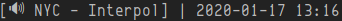

# Intro

Use Spotify's MPRIS2 D-Bus interface to pull information on your current track.



# Usage

``` 
$ ./spot_track
Shells - Mo Lowda & The Humble
```

# Portability

Relies on `dbus` but you probably have it included if your distro uses `systemd`.
